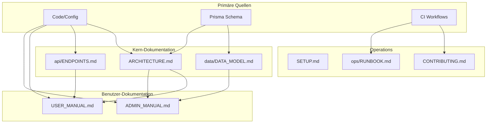

# ZollPilot Change Impact Matrix

**Stand:** 2026-01-25 | **Phase:** 0.9.2

## Übersicht

Diese Matrix zeigt, welche Dokumentationen bei Änderungen an bestimmten Modulen aktualisiert werden müssen.

## Matrix: Code → Dokumentation

| Geändertes Modul | Zu aktualisierende Docs |
|------------------|-------------------------|
| `apps/web/src/app/` | USER_MANUAL.md, ARCHITECTURE.md |
| `apps/web/src/app/admin/` | ADMIN_MANUAL.md, ARCHITECTURE.md |
| `apps/web/src/app/api/` | api/ENDPOINTS.md, api/API_OVERVIEW.md |
| `apps/web/src/server/` | architecture/OVERVIEW.md |
| `apps/web/prisma/schema.prisma` | data/DATA_MODEL.md, ARCHITECTURE.md |
| `apps/web/prisma/seed.ts` | data/DATA_MODEL.md, ops/RUNBOOK.md |
| `apps/web/test/` | testing/TEST_STRATEGY.md |
| `apps/web/e2e/` | testing/TEST_STRATEGY.md, SETUP.md |
| `packages/shared/` | architecture/OVERVIEW.md |
| `packages/config/` | architecture/OVERVIEW.md, SETUP.md |
| `.github/workflows/` | CONTRIBUTING.md, POLICIES.md |
| `.github/dependabot.yml` | CONTRIBUTING.md, security/SECURITY_BASELINE.md |
| `docker-compose.dev.yml` | ops/RUNBOOK.md, SETUP.md, integrations/INTEGRATIONS.md |
| `.env.example` | SETUP.md, integrations/INTEGRATIONS.md |
| `package.json` (scripts) | ops/RUNBOOK.md, SETUP.md |
| `package.json` (deps) | architecture/OVERVIEW.md (bei Major Updates) |
| `next.config.js` | architecture/OVERVIEW.md, security/SECURITY_BASELINE.md |
| `vitest.config.ts` | testing/TEST_STRATEGY.md |
| `playwright.config.ts` | testing/TEST_STRATEGY.md |

## Matrix: Feature → Dokumentation

| Neues Feature | Zu erstellende/aktualisierende Docs |
|---------------|-------------------------------------|
| Neuer API-Endpunkt | api/ENDPOINTS.md |
| Neues DB-Model | data/DATA_MODEL.md |
| Neue Integration | integrations/INTEGRATIONS.md |
| Auth-Änderung | security/SECURITY_BASELINE.md, api/API_OVERVIEW.md |
| UI-Feature (Public) | USER_MANUAL.md |
| UI-Feature (Admin) | ADMIN_MANUAL.md |
| CI-Änderung | CONTRIBUTING.md, POLICIES.md |
| Setup-Änderung | SETUP.md, ops/RUNBOOK.md |

## Dokumentations-Update-Checkliste

Bei jeder Änderung prüfen:

### Code-Änderungen

- [ ] Betroffene Docs aus obiger Matrix identifiziert
- [ ] API-Änderungen in ENDPOINTS.md dokumentiert
- [ ] Schema-Änderungen in DATA_MODEL.md dokumentiert
- [ ] Neue Dependencies in OVERVIEW.md erwähnt
- [ ] Setup-Änderungen in SETUP.md/RUNBOOK.md aktualisiert

### Feature-Änderungen

- [ ] User-facing Features in USER_MANUAL.md
- [ ] Admin Features in ADMIN_MANUAL.md
- [ ] Architektur-Entscheidungen in DECISIONS.md

### Infrastruktur-Änderungen

- [ ] CI-Änderungen in CONTRIBUTING.md
- [ ] Security-Änderungen in SECURITY_BASELINE.md
- [ ] Neue Integrationen in INTEGRATIONS.md

## Abhängigkeits-Graph



## Automatisierung (geplant)

### Phase 0.10: Doc-Drift-Check

```bash
# Geplante Implementation
pnpm docs:check
```

**Prüfungen:**
1. Schema vs DATA_MODEL.md Konsistenz
2. API-Routes vs ENDPOINTS.md Konsistenz
3. package.json Scripts vs RUNBOOK.md Konsistenz
4. Alle TBD-Marker auflisten

### Pre-Commit Hook (optional)

```bash
# Warnung wenn relevante Dateien geändert wurden
# aber Docs nicht aktualisiert
```

---

**Letzte Aktualisierung:** 2026-01-25
