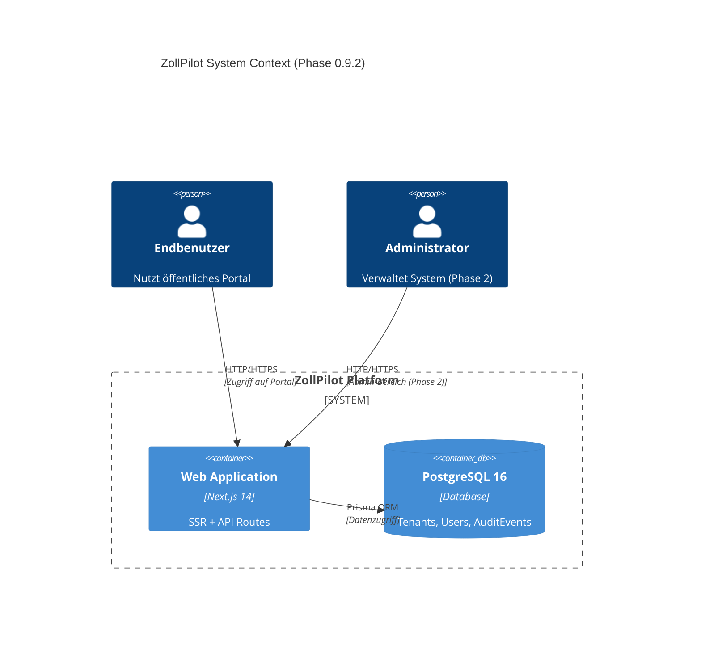
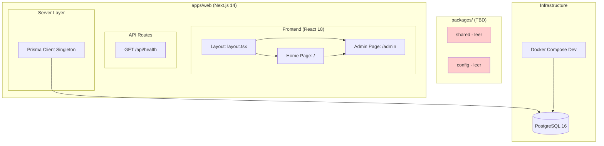
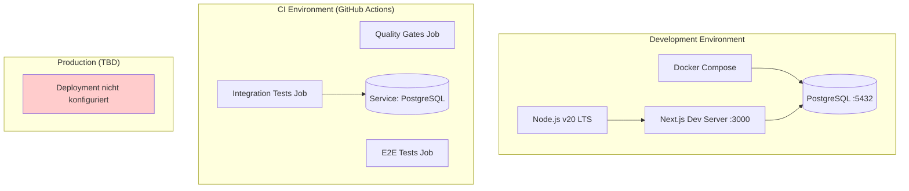
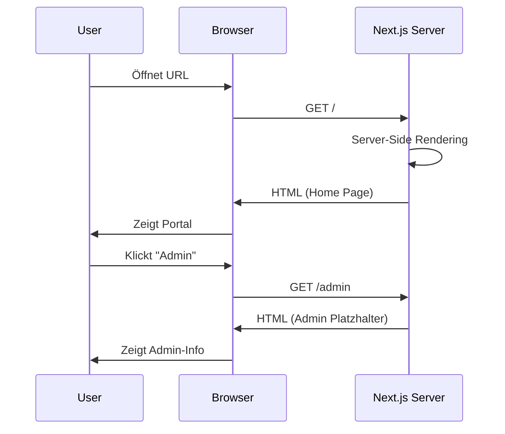
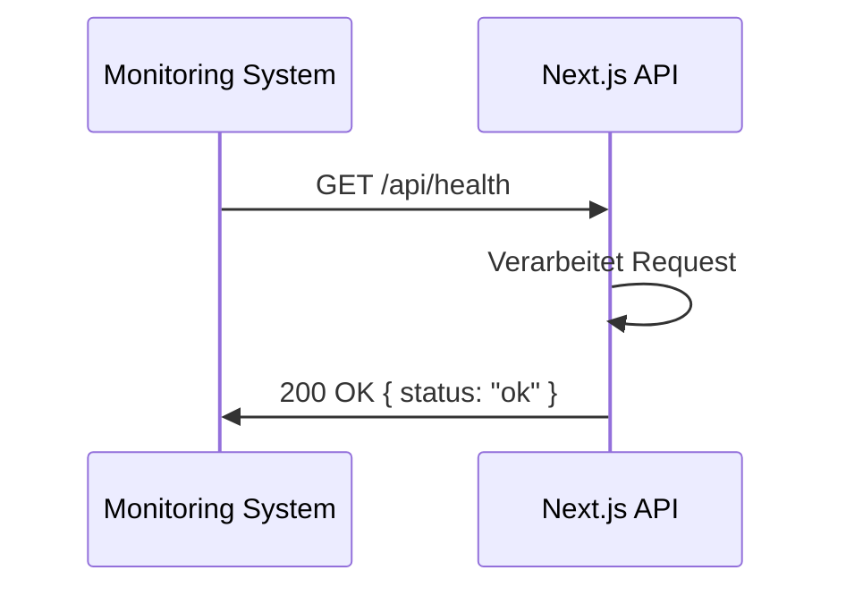
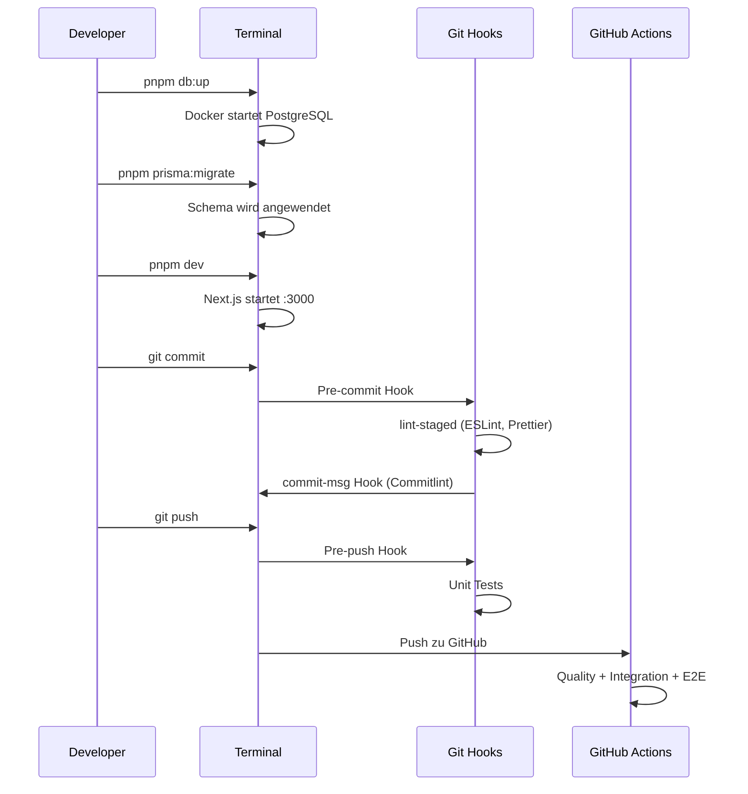

# ZollPilot Architektur-Übersicht

**Stand:** 2026-01-25 | **Phase:** 0.9.2 | **Audit-Status:** IST-Zustand dokumentiert

## Inhaltsverzeichnis

- [Systemübersicht](#systemübersicht)
- [Komponentendiagramm](#komponentendiagramm)
- [Deployment-Diagramm](#deployment-diagramm)
- [Komponentenbeschreibungen](#komponentenbeschreibungen)
- [Key User Journeys](#key-user-journeys)
- [Architekturprinzipien](#architekturprinzipien)
- [Technologie-Stack](#technologie-stack)

## Systemübersicht

ZollPilot ist eine Plattform zur strukturierten Verwaltung von Zolldaten. Das System besteht aus:

| Komponente | Typ | Status | Beschreibung |
|------------|-----|--------|--------------|
| `apps/web` | Next.js 14 App | Aktiv | Monolithische Web-Anwendung (SSR + API Routes) |
| `packages/shared` | Library | Leer/TBD | Geplant für gemeinsame Types/Utilities |
| `packages/config` | Library | Leer/TBD | Geplant für gemeinsame Konfigurationen |
| PostgreSQL | Database | Aktiv | Primäre Datenbank (via Docker in Dev) |

### Aktueller Scope (Phase 0.9.2)

**Implementiert:**
- Next.js App-Shell mit grundlegender Navigation
- Health-Check API-Endpunkt
- PostgreSQL-Datenbankschema (Prisma)
- Multi-Tenancy-Datenmodell
- Audit-Trail-Infrastruktur
- CI/CD Pipeline (GitHub Actions)
- Git Hooks (Husky + Commitlint)
- Dependabot-Konfiguration

**Nicht implementiert (geplant für Phase 2+):**
- Authentifizierung/Autorisierung
- Admin-Funktionalität
- Preiskonfiguration
- Zolldaten-Suche/-Navigation
- Benutzer-Management

## Komponentendiagramm

## Deployment-Diagramm

## Komponentenbeschreibungen

### apps/web

**Verantwortlichkeit:** Hauptanwendung - öffentliches Portal und Admin-Backend

| Verzeichnis | Inhalt | Dateien |
|-------------|--------|---------|
| `src/app/` | App Router Pages | `layout.tsx`, `page.tsx` |
| `src/app/admin/` | Admin-Bereich | `page.tsx` (Platzhalter) |
| `src/app/api/health/` | Health-Check API | `route.ts` |
| `src/server/` | Server-seitige Logik | `db.ts` (Prisma Singleton) |
| `prisma/` | Datenbankschema | `schema.prisma`, `seed.ts` |
| `test/` | Test-Utilities | `factories.ts`, `db-utils.ts`, Setup-Dateien |
| `e2e/` | E2E-Tests | `*.e2e.spec.ts` |

**Grenzen:**
- Keine Business-Logik implementiert (Phase 2)
- Kein Authentifizierung/Session-Management
- Keine API-Endpunkte außer Health-Check

### packages/shared

**Status:** Leer - geplant für Phase 2+

**Geplanter Inhalt:**
- Gemeinsame TypeScript-Typen
- Utility-Funktionen
- Konstanten

### packages/config

**Status:** Leer - geplant für Phase 2+

**Geplanter Inhalt:**
- TSConfig-Presets
- ESLint-Konfigurationen
- Gemeinsame Tool-Konfigurationen

## Key User Journeys

### Journey 1: Öffentliches Portal besuchen

### Journey 2: Health-Check (Monitoring)

### Journey 3: Entwickler-Workflow (Lokal)

## Architekturprinzipien

### 1. Test-Driven Development (TDD)

- **Regel:** Tests VOR Implementation
- **Enforcement:** ≥80% Coverage-Threshold in Vitest
- **Ebenen:** Unit → Integration → E2E

### 2. Nothing Undocumented

- **Regel:** Jedes Feature muss dokumentiert sein
- **Enforcement:** Doc-Drift-Check geplant (Phase 0.10)

### 3. Immutable Audit Trail

- **Regel:** Alle Admin-Aktionen erzeugen Audit-Events
- **Schema:** `AuditEvent`-Model mit Tenant, Actor, Action, Metadata
- **Status:** Infrastruktur vorhanden, Enforcement in Phase 2

### 4. Multi-Tenancy by Design

- **Regel:** Datenisolierung pro Tenant
- **Schema:** Alle User und AuditEvents haben `tenantId`
- **Constraint:** Email unique pro Tenant (`@@unique([tenantId, email])`)

## Technologie-Stack

### Core

| Technologie | Version | Quelle | Zweck |
|-------------|---------|--------|-------|
| Node.js | v20 LTS | `.nvmrc` | Runtime |
| pnpm | 9.15.2 | `package.json` (packageManager) | Package Manager |
| TypeScript | 5.7.2 | `apps/web/package.json` | Sprache |

### Frontend

| Technologie | Version | Quelle | Zweck |
|-------------|---------|--------|-------|
| Next.js | 14.2.21 | `apps/web/package.json` | Framework |
| React | 18.3.1 | `apps/web/package.json` | UI Library |
| React DOM | 18.3.1 | `apps/web/package.json` | DOM Binding |

### Backend / Database

| Technologie | Version | Quelle | Zweck |
|-------------|---------|--------|-------|
| PostgreSQL | 16-alpine | `docker-compose.dev.yml` | Datenbank |
| Prisma Client | 6.1.0 | `apps/web/package.json` | ORM |
| Prisma CLI | 6.1.0 | `apps/web/package.json` (dev) | Schema Management |

### Testing

| Technologie | Version | Quelle | Zweck |
|-------------|---------|--------|-------|
| Vitest | 4.0.18 | `apps/web/package.json` | Unit/Integration |
| Playwright | 1.58.0 | `apps/web/package.json` | E2E |
| Testing Library React | 16.1.0 | `apps/web/package.json` | React Testing |
| jsdom | 25.0.1 | `apps/web/package.json` | DOM Simulation |

### Code Quality

| Technologie | Version | Quelle | Zweck |
|-------------|---------|--------|-------|
| ESLint | 8.57.1 | `apps/web/package.json` | Linting |
| Prettier | 3.8.1 | `package.json` | Formatting |
| Husky | 9.1.7 | `package.json` | Git Hooks |
| lint-staged | 16.2.7 | `package.json` | Staged File Linting |
| Commitlint | 20.3.1 | `package.json` | Commit Message Validation |

### CI/CD

| Technologie | Version | Quelle | Zweck |
|-------------|---------|--------|-------|
| GitHub Actions | - | `.github/workflows/ci.yml` | CI Pipeline |
| Dependabot | v2 | `.github/dependabot.yml` | Dependency Updates |

---

**Letzte Aktualisierung:** 2026-01-25
**Nächste Review:** Nach Phase 1 Implementation
